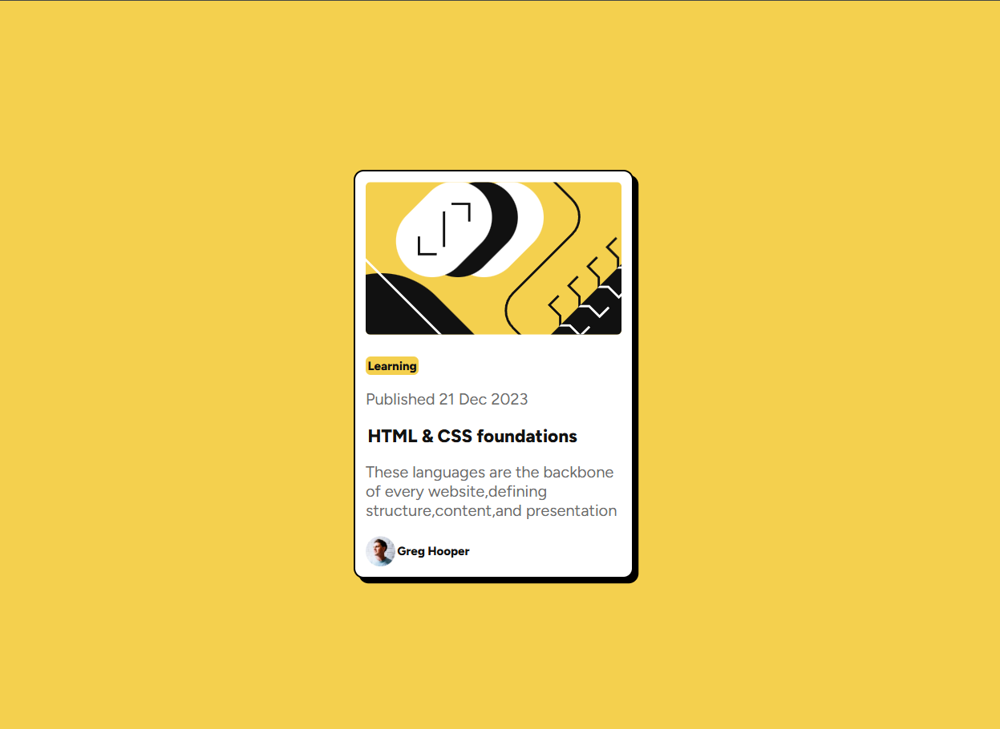

# Frontend Mentor - Blog preview card solution

This is a solution to the [Blog preview card challenge on Frontend Mentor](https://www.frontendmentor.io/challenges/blog-preview-card-ckPaj01IcS). Frontend Mentor challenges help you improve your coding skills by building realistic projects. 

## Table of contents

- [Overview](#overview)
  - [The challenge](#the-challenge)
  - [Screenshot](#screenshot)
  - [Links](#links)
- [My process](#my-process)
  - [Built with](#built-with)
  - [What I learned](#what-i-learned)
-[Author](#author)

## Overview

### The challenge

Users should be able to:

- See hover and focus states for all interactive elements on the page

### Screenshot



### Links

- Solution URL: https://github.com/vivek-landge/Blog-Preveiw-card
- Live Site URL: https://vivek-landge.github.io/Blog-Preveiw-card/

## My process

### Built with

- Semantic HTML5 markup
- CSS custom properties
- Flexbox
- CSS Grid
- Mobile-first workflow


### What I learned
With this project I have learnt the use of flex box and how can i align the elemenrs in it horizontally and vertically using the property flex-direction. i have also learnt about the concept of event listener that helps make the UI responsive. i made use of the following js code to change the color of the text when hovering the mouse over it:  
``` js
const tag = document.querySelector(".tag");

tag.addEventListener("mouseover", () => {
    tag.style.color = "hsl(47, 88%, 63%)";
});

tag.addEventListener("mouseout", () => {
    tag.style.color = "hsl(0, 0%, 7%)";
});
```
## Author

- Website - Vivek Landge
- Frontend Mentor -  https://www.frontendmentor.io/profile/vivek-landge

